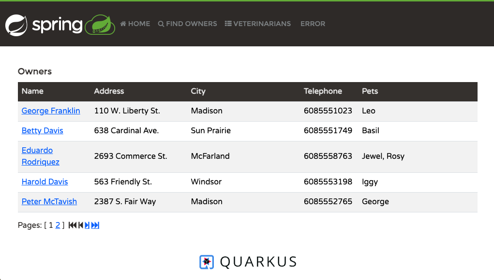

# Spring PetClinic Sample Application [](https://github.com/spring-petclinic/quarkus-spring-petclinic/actions/workflows/maven-build.yml)[](https://github.com/spring-petclinic/quarkus-spring-petclinic/actions/workflows/gradle-build.yml)

[](https://gitpod.io/#https://github.com/spring-petclinic/quarkus-spring-petclinic) [](https://github.com/codespaces/new?hide_repo_select=true&ref=main&repo=959372526)

This Spring Petclinic fork is a [Quarkus](https://quarkus.io/) application built using [Maven](https://spring.io/guides/gs/maven/) or [Gradle](https://spring.io/guides/gs/gradle/).
This Quarkus application have been **created from a Spring Boot application**.
It uses almost all the **Spring extensions provided by Quarkus** : **Spring DI**, **Spring Web**, **Spring Data JPA**, **Spring Cache** and **Spring Boot properties**.

## Running the application in dev mode

Make sure you have Java 17 or a later version of Java installed.
Then you can run your application in dev mode that enables live coding using:

```shell script
git clone https://github.com/spring-petclinic/quarkus-spring-petclinic.git
cd quarkus-spring-petclinic
./mvnw quarkus:dev
```

You can then access the Petclinic at <http://localhost:8080/>.



> **_NOTE:_**  Quarkus now ships with a Dev UI, which is available in dev mode only at <http://localhost:8080/q/dev/>.

> NOTE: If you prefer to use Gradle, you can build the app using `./gradlew build` and look for the jar file in `build/libs`.

In development mode, you can start Quarkus with debug mode enabled, listening on port 5005, without stopping the JVM:
```shell script
./gradlew --console=plain quarkusDev
```

## Packaging and running the application

The application can be packaged using:

```shell script
./mvnw package
```

It produces the `quarkus-run.jar` file in the `target/quarkus-app/` directory.
Be aware that it’s not an _über-jar_ as the dependencies are copied into the `target/quarkus-app/lib/` directory.

The application is now runnable using `java -jar target/quarkus-app/quarkus-run.jar`.

If you want to build an _über-jar_, execute the following command:

```shell script
./mvnw package -Dquarkus.package.jar.type=uber-jar
```

The application, packaged as an _über-jar_, is now runnable using `java -jar target/*-runner.jar`.

## Creating a native executable

You can install GraalVM then create a [native executable](https://quarkus.io/guides/building-native-image) using:

```shell script
sdk install java 21-graal
export GRAALVM_HOME=$HOME/.sdkman/candidates/java/21.0.5-graal    
export PATH=${GRAALVM_HOME}/bin:$PATH
./mvnw package -Dnative -Dquarkus.profile=postgres
docker compose up postgres 
./target/quarkus-spring-petclinic-3.4.0-SNAPSHOT-runner
```

H2 database native executable is not possible because of the limitation of Quarkus.
You have to use the `quarkus.profile=postgresl` to use the PostgreSQL database.

Or, if you don't have GraalVM installed, you can run the native executable build in a container using:

```shell script
./mvnw package -Dnative -Dquarkus.profile=postgresl -Dquarkus.native.container-build=true
```

You can then execute your native executable with: `./target/quarkus-spring-petclinic-1.0.0-SNAPSHOT-runner`

If you want to learn more about building native executables, please consult <https://quarkus.io/guides/maven-tooling>.

## Related Guides

- Quarkus Extension for Spring DI API ([guide](https://quarkus.io/guides/spring-di)): Define your dependency injection with Spring DI
- Quarkus Extension for Spring Web API ([guide](https://quarkus.io/guides/spring-web)): Use Spring Web annotations to create your REST services
- Quarkus Extension for Spring Data JPA API ([guide](https://quarkus.io/guides/spring-data-jpa)): Use Spring Data JPA annotations to create your data access layer
- Quarkus Extension for Spring Boot properties ([guide](https://quarkus.io/guides/spring-boot-properties)): Use Spring Boot properties annotations to configure your application
- Quarkus Extension for Spring Cache API([guide](https://quarkus.io/guides/spring-cache): Use Spring Cache annotations to cache the results of your methods


## Building a Container

There is are some `Dockerfile` in the `src/main/docker` directory. You can build a container image (if you have a docker daemon) using the `quarkus-container-image-docker` Quarkus extension:

```bash
./mvnw install -Dquarkus.container-image.build=true
```

## In case you find a bug/suggested improvement for Spring Petclinic

Our issue tracker is available [here](https://github.com/spring-petclinic/quarkus-spring-petclinic/issues).

## Database configuration

In its default configuration, Petclinic uses an in-memory database (H2) which
gets populated at startup with data. 
It is possible to inspect the content of the database using the `jdbc:h2:mem:<uuid>` URL. The UUID is printed at startup to the console.

A similar setup is provided for MySQL and PostgreSQL if a persistent database configuration is needed. Note that whenever the database type changes, the app needs to run with a different profile: `quarkus.profile=mysql` for MySQL or `quarkus.profile=postgres` for PostgreSQL.
See the [Quarkus Configuration Reference Guide](https://quarkus.io/guides/config-reference#profiles) for more detail on how to set the active profile.

You can start MySQL or PostgreSQL locally with whatever installer works for your OS or use docker:

```bash
docker run -e MYSQL_USER=petclinic -e MYSQL_PASSWORD=petclinic -e MYSQL_ROOT_PASSWORD=root -e MYSQL_DATABASE=petclinic -p 3306:3306 mysql:9.1
```

or

```bash
docker run -e POSTGRES_USER=petclinic -e POSTGRES_PASSWORD=petclinic -e POSTGRES_DB=petclinic -p 5432:5432 postgres:17.0
```

Further documentation is provided for [MySQL](https://github.com/spring-petclinic/quarkys-spring-petclinic/blob/main/src/main/resources/db/mysql/petclinic_db_setup_mysql.txt)
and [PostgreSQL](https://github.com/spring-petclinic/quarkus-spring-petclinic/blob/main/src/main/resources/db/postgresql/petclinic_db_setup_postgres.txt).

Instead of vanilla `docker` you can also use the provided `docker-compose.yml` file to start the database containers. Each one has a service named after the Spring profile:

```bash
docker compose up mysql
```

or

```bash
docker compose up postgres
```

## Test Applications

At development time we recommend you use the test applications set up as `main()` methods in `PetClinicIntegrationTests` (using the default H2 database and also adding Spring Boot Devtools), `MySqlTestApplication` and `PostgresIntegrationTests`. These are set up so that you can run the apps in your IDE to get fast feedback and also run the same classes as integration tests against the respective database. The MySql integration tests use Testcontainers to start the database in a Docker container, and the Postgres tests use Docker Compose to do the same thing.

## Compiling the CSS

There is a `petclinic.css` in `src/main/resources/META-INF/resources/css`. It was generated from the `petclinic.scss` source, combined with the [Bootstrap](https://getbootstrap.com/) library. If you make changes to the `scss`, or upgrade Bootstrap, you will need to re-compile the CSS resources using the Maven profile "css", i.e. `./mvnw package -P css`. There is no build profile for Gradle to compile the CSS.

## Working with Petclinic in your IDE

### Prerequisites

The following items should be installed in your system:

- Java 17 or newer (full JDK, not a JRE)
- [Git command line tool](https://help.github.com/articles/set-up-git)
- Your preferred IDE
  - Eclipse with the m2e plugin. Note: when m2e is available, there is an m2 icon in `Help -> About` dialog. If m2e is
  not there, follow the install process [here](https://www.eclipse.org/m2e/)
  - [IntelliJ IDEA](https://www.jetbrains.com/idea/)
  - [VS Code](https://code.visualstudio.com)

### Steps

1. On the command line run:

    ```bash
    git clone https://github.com/spring-petclinic/quarkus-spring-petclinic.git
    ```

1. Inside Eclipse or STS:

    Open the project via `File -> Import -> Maven -> Existing Maven project`, then select the root directory of the cloned repo.

    Then either build on the command line `./mvnw generate-resources` or use the Eclipse launcher (right-click on project and `Run As -> Maven install`) to generate the CSS. Run the application's main method by right-clicking on it and choosing `Run As -> Java Application`.

1. Inside IntelliJ IDEA:

    In the main menu, choose `File -> Open` and select the Petclinic [pom.xml](pom.xml). Click on the `Open` button.

    - CSS files are generated from the Maven build. You can build them on the command line `./mvnw generate-resources` or right-click on the `quarkus-spring-petclinic` project then `Maven -> Generates sources and Update Folders`.

    - A run configuration named `PetClinicApplication` should have been created for you if you're using a recent Ultimate version. Otherwise, run the application by right-clicking on the `PetClinicApplication` main class and choosing `Run 'PetClinicApplication'`.

1. Navigate to the Petclinic

    Visit [http://localhost:8080](http://localhost:8080) in your browser.

## Looking for something in particular?

| QuarkusConfiguration  | Class or Java property files                                                                                                                                                    |
|-----------------------|---------------------------------------------------------------------------------------------------------------------------------------------------------------------------------|
| Owner REST Controller | [OwnerController](https://github.com/spring-petclinic/quarkus-spring-petclinic/blob/main/src/main/java/org/springframework/samples/petclinic/owner/OwnerController.java)        |
| Owner JPA Repository  | [OwnerController](https://github.com/spring-petclinic/quarkus-spring-petclinic/blob/main/src/main/java/org/springframework/samples/petclinic/owner/OwnerRepository.java)        |
| Properties Files      | [application.properties](https://github.com/spring-petclinic/quarkus-spring-petclinic/blob/main/src/main/resources)                                                             |

## Interesting Spring Petclinic branches and forks

The Spring Petclinic "main" branch in the [spring-projects](https://github.com/spring-projects/spring-petclinic)
GitHub org is the "canonical" implementation based on Spring Boot and Thymeleaf. There are
[quite a few forks](https://spring-petclinic.github.io/docs/forks.html) in the GitHub org
[spring-petclinic](https://github.com/spring-petclinic). If you are interested in using a different technology stack to implement the Pet Clinic, please join the community there.

## Interaction with other open-source projects

One of the best parts about working on the Spring Petclinic application is that we have the opportunity to work in direct contact with many Open Source projects. We found bugs/suggested improvements on various topics such as Spring, Spring Data, Bean Validation and even Eclipse! In many cases, they've been fixed/implemented in just a few days.
Here is a list of them:

| Name | Issue |
|------|-------|
| Spring JDBC: simplify usage of NamedParameterJdbcTemplate | [SPR-10256](https://github.com/spring-projects/spring-framework/issues/14889) and [SPR-10257](https://github.com/spring-projects/spring-framework/issues/14890) |
| Bean Validation / Hibernate Validator: simplify Maven dependencies and backward compatibility |[HV-790](https://hibernate.atlassian.net/browse/HV-790) and [HV-792](https://hibernate.atlassian.net/browse/HV-792) |
| Spring Data: provide more flexibility when working with JPQL queries | [DATAJPA-292](https://github.com/spring-projects/spring-data-jpa/issues/704) |

## Contributing

The [issue tracker](https://github.com/spring-petclinic/quarkus-spring-petclinic/issues) is the preferred channel for bug reports, feature requests and submitting pull requests.

For pull requests, editor preferences are available in the [editor config](.editorconfig) for easy use in common text editors. Read more and download plugins at <https://editorconfig.org>. If you have not previously done so, please fill out and submit the [Contributor License Agreement](https://cla.pivotal.io/sign/spring).

## License

The Spring PetClinic sample application is released under version 2.0 of the [Apache License](https://www.apache.org/licenses/LICENSE-2.0).
